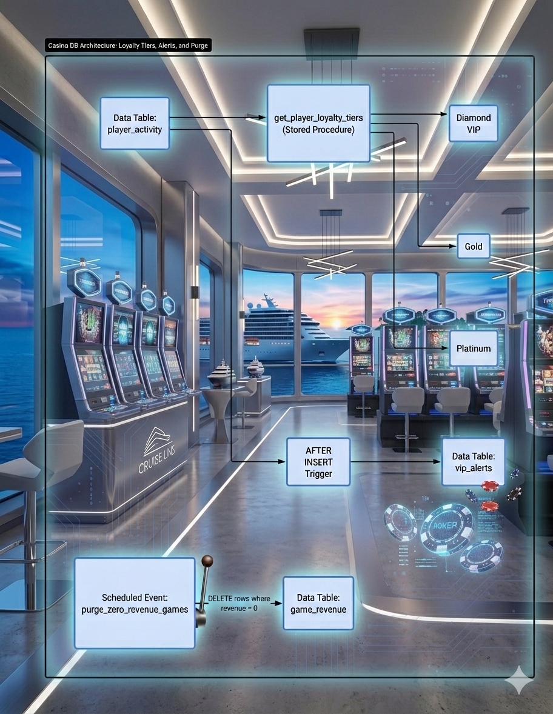

# Casino-DB-Pipeline

An automated MySQL backend data pipeline for player loyalty segmentation, live high-roller alerts, and scheduled database optimization on a cruise line gaming floor.

# PROJECT SUMMARY
# Casino: Data Infrastructure & Automation Pipeline

## 📌 Business Scenario
Managing data operations on a modern cruise ship casino requires efficient, automated background processing to conserve satellite bandwidth and keep live dashboards running quickly. 

This project establishes an automated relational database pipeline that manages high-roller tracking, processes tiered player loyalty logic on demand, and schedules database self-maintenance routines.

## 🗺️ System Architecture Blueprint
Here is the structural mapping of how the data flows through the backend automation engines:


## 🛠️ Solutions Implemented

### 1. On-Demand Player Profiling (Stored Procedure)
* **Objective:** Allows the VIP casino hosts on the ship floor to instantly pull a breakdown of customer tiers without manually grouping financial records.
* **Logic:** Uses a custom `CASE WHEN` algorithm to segment players into `Diamond VIP`, `Platinum`, and `Gold` groups based on lifetime wagered metrics.

### 2. High-Roller Intercept Guard (Event-Driven Trigger)
* **Objective:** Instantly logs high-dollar transactions into a dedicated security table so hosts can be dispatched to the player's slot machine or table game in real time.
* **Logic:** Runs an `AFTER INSERT` trigger on the core activity ledger, pulling the freshly added record values instantly before they can settle asynchronously.

### 3. Automated Storage Performance Purge (Scheduled Event)
* **Objective:** Frees up indexing overhead on shipboards servers by purging zero-revenue slots and underperforming table records.
* **Logic:** Runs a daily background maintenance job on the database clock system (`ON SCHEDULE EVERY 1 DAY`) to systematically drop row data where revenue equals zero.

## 📊 Business Intelligence & Core Analytics

To extract meaningful financial and security insights from the cruise ship casino floor, the database implements advanced multi-table relational analysis (`JOINS`).

### 1. High-Roller Security Dispatch Protocol (INNER JOIN)
Matches automated security trigger payloads back to the core passenger ledger so casino hosts can identify high-rollers by name in real time:

```sql
SELECT 
    v.alert_id,
    p.player_name,
    v.large_wager,
    v.alert_status,
    v.alert_timestamp
FROM vip_alerts v
INNER JOIN player_activity p 
    ON v.player_id = p.player_id;
    ```
    
    